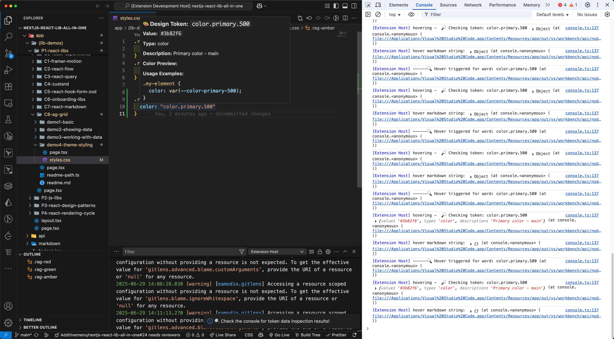
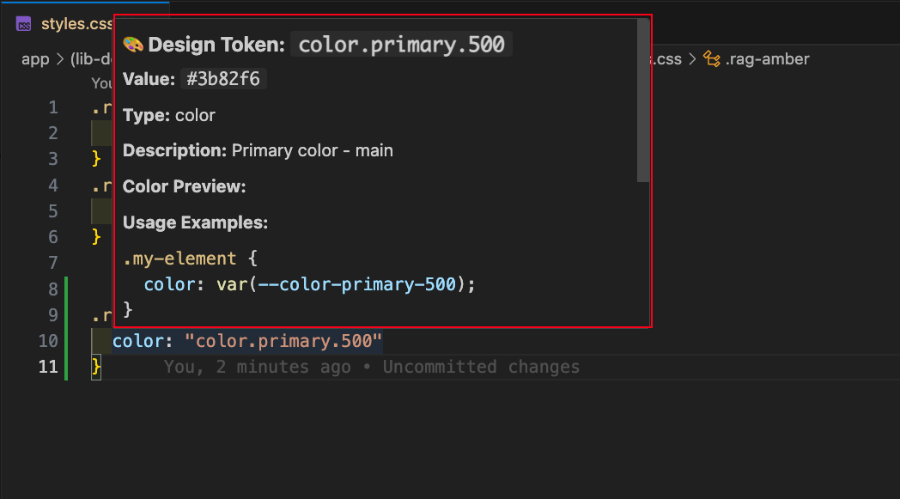

# Design Token Tooltip

A VS Code extension that provides hover tooltips and inline color previews for design tokens, similar to Tailwind CSS IntelliSense.

- [how to distribute and use the extension](./use-extension.md)

## Quick Start for Developing the extension

### 1. Installation

Install the extension in VS Code or run it in development mode.

### 2. Configure Token File Path

Set the path to your design tokens JSON file in VS Code settings:

```json
{
  "designToken.filePath": "./src/tokens/design-tokens.json",
  "designToken.inlineColorPreview": true
}
```

### 3. Usage Examples

Once configured, the extension will automatically detect and enhance design tokens in your code:

#### TypeScript/JavaScript

```typescript
const styles = {
  primary: "brand.primary-500", // Shows color swatch inline
  secondary: "system.gray-200", // Shows color swatch inline
  background: "surface.light", // Shows color swatch inline
};

// Object property access
const colors = tokens.brand.primary500; // Shows color swatch inline
```

#### CSS/SCSS

```css
.button {
  color: var(--brand-primary-500); /* Shows color swatch inline */
  background: var(--surface-light); /* Shows color swatch inline */
}
```

```scss
.button {
  color: $brand-primary-500; // Shows color swatch inline
  background: $surface-light; // Shows color swatch inline
}
```

### 4. Commands

- **Ctrl+Shift+P** → "Reload Design Tokens" - Refresh token data
- **Ctrl+Shift+P** → "Toggle Inline Color Preview" - Enable/disable color swatches
- **Ctrl+Shift+P** → "Inspect Design Token Data" - View loaded token information

## Development and Testing

### 1. Set Up Development Environment

```bash
# Create extension directory
mkdir design-token-tooltip
cd design-token-tooltip

# Initialize project
npm init -y

# Install dependencies
npm install --save-dev @types/vscode @types/node typescript

# Create TypeScript config
echo '{
  "compilerOptions": {
    "module": "commonjs",
    "target": "ES2020",
    "outDir": "out",
    "lib": ["ES2020"],
    "sourceMap": true,
    "rootDir": "src",
    "strict": true
  }
}' > tsconfig.json
```

### 2. Project Structure

```
design-token-tooltip/
├── src/
│   └── extension.ts        # Main code file
├── package.json           # Extension config
├── tsconfig.json         # TypeScript config
└── tokens.json           # Example token data
```

### 3. Start Development Mode

```bash
# Compile code
npx tsc -p ./

# Or watch mode (recommended)
npx tsc -watch -p ./
```

### 4. Test in VSCode

1. Open the extension project folder in VSCode
2. Press `F5` or `Ctrl+F5` to start debugging
3. This opens a new "Extension Development Host" window
4. The extension will auto-activate in the new window

## Extension Activation and Deactivation

### Auto Activation

The extension auto-activates when:

- Supported file types are opened (CSS, SCSS, JS, TS, Vue, HTML)
- VSCode starts (if previously used)

### Manual Control

#### View Extension Status

1. Open Command Palette: `Ctrl+Shift+P` (Windows/Linux) or `Cmd+Shift+P` (Mac)
2. Enter "Extensions: Show Running Extensions"
3. You can see all running extensions

#### Reload Extension

```bash
# In Command Palette
Developer: Reload Window
```

#### Disable Extension

1. Open Extensions panel: `Ctrl+Shift+X`
2. Find your extension
3. Click the "Disable" button

#### Reload Token Data

```bash
# In Command Palette
Design Token: Reload Design Tokens
```

## Production Deployment

### Package Extension

```bash
# Install packaging tool
npm install -g vsce

# Package as .vsix file
vsce package
```

### Install Packaged Extension

```bash
# Install from .vsix file
code --install-extension design-token-tooltip-0.0.1.vsix
```

### Uninstall Extension

```bash
# Uninstall from command line
code --uninstall-extension your-publisher.design-token-tooltip

# Or click uninstall in VSCode Extensions panel
```

## Configuration Management

### Workspace Configuration

Create `.vscode/settings.json` in the project root:

```json
{
  "designToken.filePath": "./src/tokens/design-tokens.json"
}
```

### User Configuration

Add in VSCode settings:

```json
{
  "designToken.filePath": "/path/to/your/tokens.json"
}
```

## Debugging and Logs

### View Extension Logs

1. Open Developer Tools: `Help > Toggle Developer Tools`
2. Check the extension's `console.log` output in the Console tab

### Common Debug Commands

```bash
# Restart VSCode
Developer: Reload Window

# View extension status
Developer: Show Running Extensions

# Clear extension cache
Developer: Reset Extension Host
```

## Quick Test Workflow

1. **During development:**

   ```bash
   npm run watch  # Continuous compilation
   # Open extension.ts, press F5 to start debug window (Extension Development Host)
   ```

   In the Extension Development Host interface, run `Developer: Toggle Developer Tools` → see console log results from extension logic in the 'Console' tab
   

   In the Extension Development Host interface, run the following command to reload and test the extension:

   ```json
   "commands": [
         {
           "command": "designToken.reload",
           "title": "Reload Design Tokens"
         },
         {
           "command": "designToken.test",
           "title": "Test Design Token Extension"
         }
       ]
   ```

2. **Test functionality:**

   - Create a CSS file
   - Write `color: "color.primary.500";`
   - Hover over `"color.primary.500"`
   - You should see a tooltip
     

3. **Modify configuration:**
   - Configure the token file path in settings
   - Use `Ctrl+Shift+P` → "Reload Design Tokens" to reload

## Sample token json files

- raw-tokens.json

  - Generated using token-studio and electric-transforms-studio via Style Dictionary in EDS.

- electric-raw-tokens.json

  - Derived from raw-tokens.json, generated with electric/design-token-intelliSense-raw-input via Style Dictionary in EDS.
  - Serves as the input for the TokenParser in this repository.

- flat-token-map.json
  - The core data structure used for quick lookups.
  - Generated from electric-raw-tokens.json by the TokenParser.
